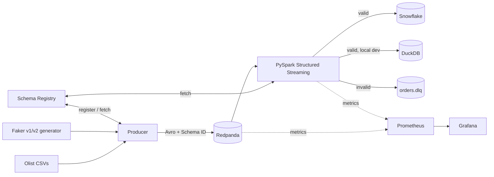

## Scope

Stage 1 only. Metadata/lineage, dbt, orchestration, and Great Expectations are deferred to Stage 2.

Success criteria for Stage 1:
- `make up` brings the full stack online on a 16GB Intel Mac 2020 without thrashing.
- Producer replays Olist orders + Faker-generated events at a configurable rate, on two schema versions, with a knob to inject malformed rows.
- PySpark job validates against Schema Registry, routes valid rows to Snowflake (or DuckDB), and bad rows to a DLQ topic.
- Grafana dashboard shows ingest lag, throughput, DLQ rate, and schema-validation failures.
- CI runs lint + unit tests + a smoke integration test on every push.

## Architecture



## Tech choices (and why)

- **Redpanda** single-node — Kafka API compatible, ~10x lighter than Kafka+ZK on a laptop. Ships with a built-in Schema Registry and Console UI.
- **Avro** for payloads — the canonical Schema Registry format; best docs for teaching schema evolution rules (backward/forward/full).
- **PySpark 3.5 Structured Streaming** in `local[2]` mode — single container, checkpoints to a mounted volume.
- **Snowflake** via `snowflake-connector-python` + `spark-snowflake` connector; **DuckDB** as local fallback sink using the same interface.
- **Prometheus + Grafana** — Redpanda exposes Prom metrics natively; Spark via its built-in `PrometheusServlet`.
- **uv** (or `pip-tools`) for fast, reproducible Python deps; **ruff** + **pytest**; **GitHub Actions** for CI.

## Repo layout

```
IronStitch/
├── docker-compose.yml            # redpanda, console, prometheus, grafana, producer, spark
├── Makefile                      # up, down, seed, produce, evolve, break, test, ci
├── pyproject.toml                # shared deps, ruff, pytest config
├── .env.example                  # SNOWFLAKE_*, SINK=snowflake|duckdb, RATE_EPS, BAD_ROW_PCT
├── .github/workflows/ci.yml
├── schemas/
│   ├── order_item.v1.avsc        # order_id, item_id, price, ts
│   └── order_item.v2.avsc        # + discount_code (nullable, backward-compat)
├── producer/
│   └── src/{main.py, olist_loader.py, event_factory.py, bad_row_injector.py}
├── streaming/
│   └── src/{app.py, validator.py, sinks/{snowflake.py, duckdb.py, dlq.py}}
├── infra/
│   ├── prometheus/prometheus.yml
│   ├── grafana/dashboards/ironstitch.json
│   └── snowflake/bootstrap.sql   # DB, SCHEMA, WH, RAW + DLQ tables
├── data/olist/                   # gitignored; scripts/download_olist.sh
└── tests/                        # unit + one docker-based smoke test
```

## Key design decisions

- **Sink abstraction**: a tiny `Sink` protocol with `SnowflakeSink` and `DuckDBSink` implementations, selected via `SINK` env var. Keeps the Snowflake trial clock unburned during day-to-day iteration.
- **Schema evolution demo**: v2 adds `discount_code: ["null", "string"]` — backward-compatible. `make evolve` re-registers the subject and flips the producer to v2 mid-stream. A v3 with an incompatible change is included as a negative test to show Schema Registry rejecting it.
- **Bad-row injection**: `BAD_ROW_PCT` env var makes the producer emit rows that violate the Avro schema (wrong types, missing required fields). Spark routes them to `orders.dlq` with an error reason, proving the contract is enforced.
- **Checkpoints**: Spark checkpoints to `./data/checkpoints/` (bind-mounted) so restarts resume exactly.
- **Resource caps**: docker-compose sets `mem_limit` on each service; Spark pinned to 2GB, Redpanda to 1.5GB, UI/metrics ~512MB total. Producer idles <100MB.

## Stage 1 delivery order (small, verifiable steps)

1. Scaffold repo (pyproject, Makefile, .env.example, compose skeleton).
2. Bring up Redpanda + Console + Schema Registry; `make topics` creates `orders.v1` and `orders.dlq`.
3. Build producer: Olist CSV replay -> Avro v1 -> Redpanda. Register schema. Unit tests for `event_factory`.
4. Build PySpark job: read from Redpanda, decode Avro via Schema Registry, write to DuckDB sink. Verify end-to-end locally.
5. Add Snowflake sink + `bootstrap.sql`; toggle with `SINK=snowflake`.
6. Add bad-row injector + DLQ routing in the Spark job. Add a test that asserts bad rows land in DLQ.
7. Add schema v2, `make evolve` target, and the v3 incompatible-change negative demo.
8. Add Prometheus + Grafana with a prebuilt dashboard (ingest rate, consumer lag, DLQ/sec, validation errors).
9. GitHub Actions: ruff, pytest, and a compose-based smoke test (produce 100 events, assert they land in DuckDB).
10. README with a 5-minute quickstart and a troubleshooting section for Intel Mac.

## Explicitly out of scope for Stage 1 (Stage 2 preview)

DataHub/OpenMetadata lineage, dbt models on Snowflake, Dagster/Airflow orchestration, Great Expectations suites, Kubernetes, Terraform. Stage 2 will slot into the hooks Stage 1 leaves (Snowflake raw tables, DLQ topic, metrics).
